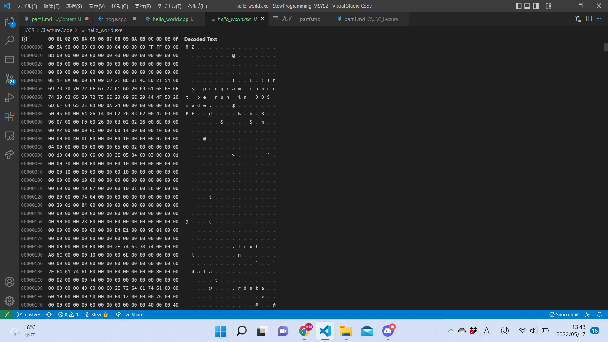
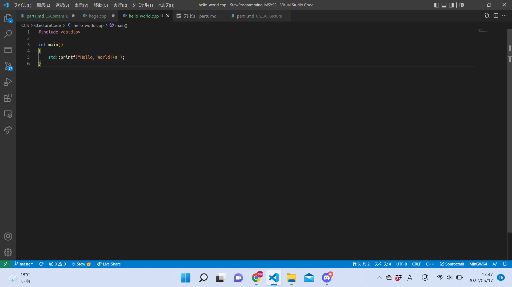

# 2022 C言語講座 第1回

## 目次


## C/C++とは
### C言語ってなに？
プログラミング言語の一つ。中でも結構古株なほう。色々な言語がC言語から派生している。例)C++, Java, C#...  
#### 特徴
**とにかく速い。**
コードが色んな計算機で動く。
様々な言語の基礎 -> 色んな言語が学びやすくなる！

### C++ってなに？
プログラミング言語の一つ。まあまあ古株なほう。C言語から派生。こっちも色んな言語に影響を与えている。
#### 特徴
**とにかく速い。**
表現力が高い。
様々モダンな言語の基礎 -> 色んな言語が学びやすくなる！

## プログラミングとは
コンピュータに実行してほしいことを、コンピュータにわかるように記述すること。  
このとき記述された命令の並びをプログラムと言う。  
  
ほとんどのコンピュータが実際に読み取るデータは、全て0か1の2進数で表される。  
だから、プログラムも最終的には0と1の並び(**機械語**)で表現されることになる。



昔はこれを手書きすることも珍しくなかった。  
  
### 機械語で書くことのメリット
挙動は記述した通りとなる。
### デメリット
読みにくい。  
記述量が多い。  
互換性がほとんど無い。(CPUの世代が違うだけでもダメなことも)  
  
そこで、人が読みやすい英数字(**ニーモニック**)で対応する機械語を(ほぼ)1対1に置き換えた言語を使う方式が現れた。これを**アセンブリ言語**という。


アセンブリ言語で書かれたコードを機械語に変換して実行する、という流れだ。
これは現代でも比較的多くのプログラマが読み書きしているらしい。  
  
### アセンブリ言語で書くことのメリット
挙動は(ほぼ)記述した通りになる。  
機械語に比べて互換性がある。  
機械語に比べて記述量を少し抑えられる。  
### デメリット
まだまだ読みにくい。  
もう少し簡潔に書きたい。  
もっと互換性のあるコードを書きたい。  

そこで、さらに読み書きしやすくなった言語が現れた。これらを  **高級言語**という。  
高級言語を機械語に変換し(この変換は多くの場合様々なステップがある)、それを実行する。  
この「高級言語で書かれたコードを機械語のコードに変換する」ことを**コンパイル**という。  
  
もちろんC/C++は高級言語である。


長い歴史と涙ぐましい努力の末、我々はたった6行でHello,World!と出力できるようになったのだ。  
~~Pythonなら一行じゃんとか言わない~~

存外前置きが長くなってしまった。ともかく、これから我々が行うのは
1. C/C++で書いたコードを
2. 機械語に翻訳(コンパイル)して
3. 実行ファイル(.exeなど)を作成する

という作業になる。

## Hello, World!
以下のコードを保存し、翻訳して実行してみよう。

```cpp
#include <stdio.h>

int main()
{
    // Hello, World!(最後で改行)を出力
    printf("Hello, World!\n");
}
```

ビルドと実行の方法はIDEそれぞれだ。  
執筆時点ではその説明を用意する時間がなさそうなので(本当に申し訳ない！)、まだ無効なリンクだけ貼っておく。  
[IDEの使い方のリンク](how_to_use_ide.md)  
<!---
誰か書いて！
-->
講座に間に合わなかったら[Wandbox](https://wandbox.org/)を使う。

### コードの解説
```cpp
#include <stdio.h>
```
これを書くことでprintfが使えるようになっている。当面はこの認識で問題ない。  
>(いつか説明を入れたいが、この講座内では厳しいと思う。moduleとか絡むので執筆者が全様を把握していない...)  

```cpp
int main()
{
    // Hello, World!(最後で改行)を出力
    printf("Hello, World!\n");
}
```
ここでmain関数を定義している。  
関数の定義は後でしっかりやるのでここでは深く触れない。  
今の段階では、プログラムの実行時にこの関数が呼ばれるのだと思えばいい。

>main関数はプログラムを実行すると最初に呼ばれる関数で、特別扱いされる関数である。  
>ここでは深くは触れないが、普通の関数には許可されないことが可能であったり、逆に普通の関数では許可されることが場合によって許可されないことがある。例えば、main関数をプログラム内で使用してはならない。

