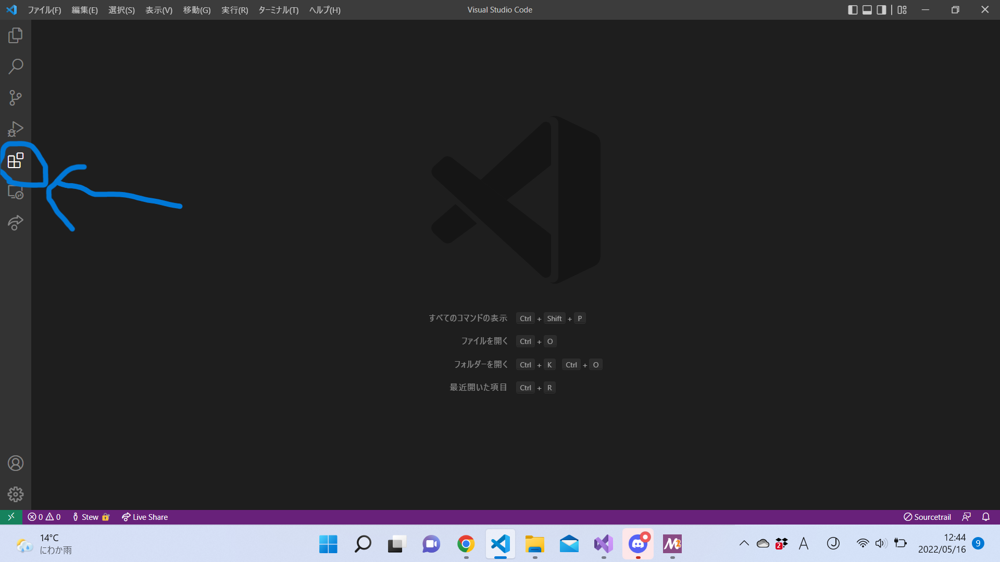
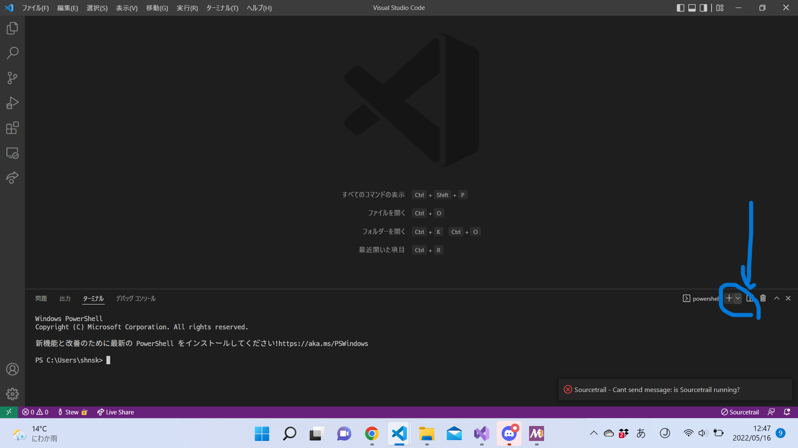

# Visual Studio Code(以下VSCode)のインストール
これはあくまで一例です。
俺はターミナルはWindows PowerShellがいいんだ！とかclang使いたいんだ！とかあればご自由にどうぞ。
上手くいかなかったり、何か疑問があればStewまで。なるべく頑張ってお答えします！

## まずはVSCodeをインストール
1. https://code.visualstudio.com/download から自身のOSに対応するものをダウンロード
2. インストーラーの指示にしたがっていく(チェックボックスを選択するところでわからないものがあったら、デフォルトのままでOK)
3. PCを再起動
4. 「Visual Studio Code」をスタートメニューから起動
5. 「拡張機能」を選び、japaneseと入力して検索する。「Japanese Language Pack for Visual Studio Code」(Microsoft製)をインストール
    
6. 同じく拡張機能からC++と検索。「C/C++」(Microsoft製)をインストール

## GCCをMSYS2経由でインストール(Windowsユーザー)
7. MSYS2のインストーラーをダウンロード(https://www.msys2.org/ のInstallationの1から)
8. 指示に従って進めていく(わからなかったら「次へ」を押してればOK)
9. スタートメニューから「MSYS2 MSYS」を起動
10.  ```pacman -Syu```を実行、適宜```y```を押していく(「Proceed with installation? [Y/n]」とか訊かれる)
11. ```pacman -S gcc```を実行、適宜```y```を押していく
12. 全部うまくいってそうなら```g++ --version```を実行
    ```
    gcc (GCC) 11.3.0
    Copyright (C) 2021 Free Software Foundation, Inc.
    This is free software; see the source for copying conditions.  There is NO
    warranty; not even for MERCHANTABILITY or FITNESS FOR A PARTICULAR PURPOSE.
    ```
   と表示されたらOK

## Visual Studio Codeで快適に開発するためにいろいろ設定(Windowsユーザー)
13. スタートメニューから「環境変数を編集」をクリック。ユーザー環境変数の「Path」を選んで「新規」を選択し、```C:\msys64\msys64\bin```を追加。
    (```C:\msys64```の部分はMSYS2をインストールするときに選んだディレクトリ)
14. PCを再起動する
15. VSCodeを開く
16. ctrl+@でターミナルを開く
17. ターミナルの左上あたりにある∨をクリックし、規定のプロファイルを選択。「MSYS2 bash」を選択。
    

以上、長かったですね...お疲れ様でした！  

## GCCをインストール
7. ターミナルを開き、```brew g++ install```を実行
8. 