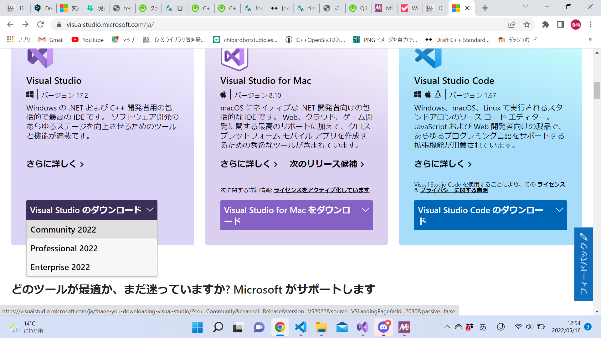
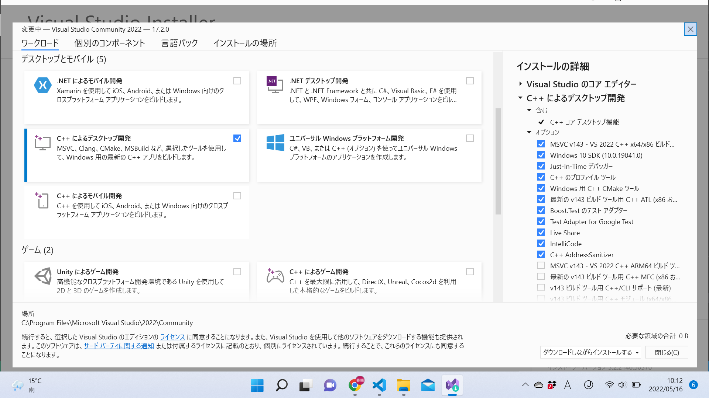

# Visual Studio 2022のインストール(Windowsユーザー向け)
これはあくまで一例です。  
上手くいかなかったり、何か疑問があればStewまで。なるべく頑張ってお答えします！  

1. https://visualstudio.microsoft.com/ja/ から「Visual Studio」の「Community 2022」を選択
   
2. ダウンロードされたexeファイルを開く
3. 「C++によるデスクトップ開発」にチェックを入れ、右下の「インストール(I)」をクリック
   
    - 他にも興味のあるものがあれば選択(当然その分重くなります)
4. めっちゃ時間かかるので暇つぶしでもしててください(PCの充電が切れないよう注意)
5. 再起動するように言われたら再起動
6. スタートメニュー(タスクバーのウィンドウのアイコンやWindowsキーで開くやつ)から「Visual Studio 2022」を開く

これでVisual Studioが起動すればOKです。お疲れ様でした。  